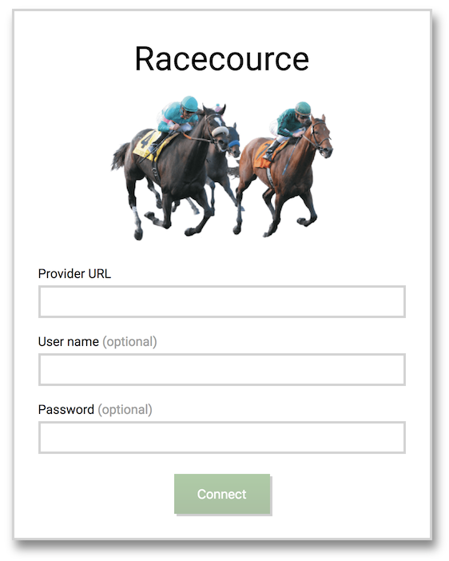
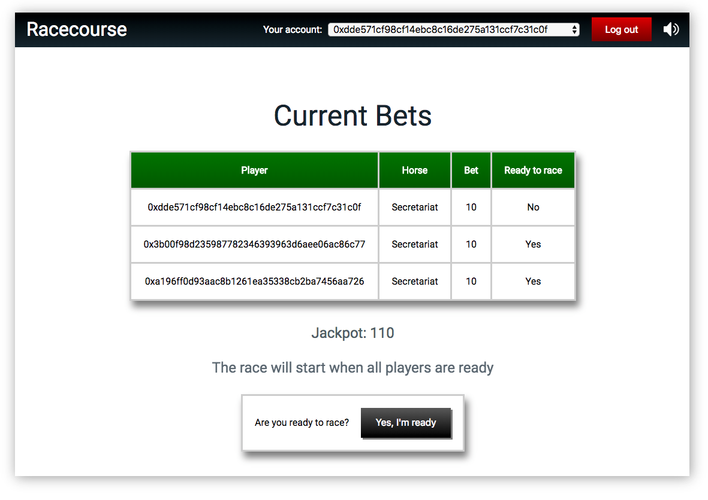
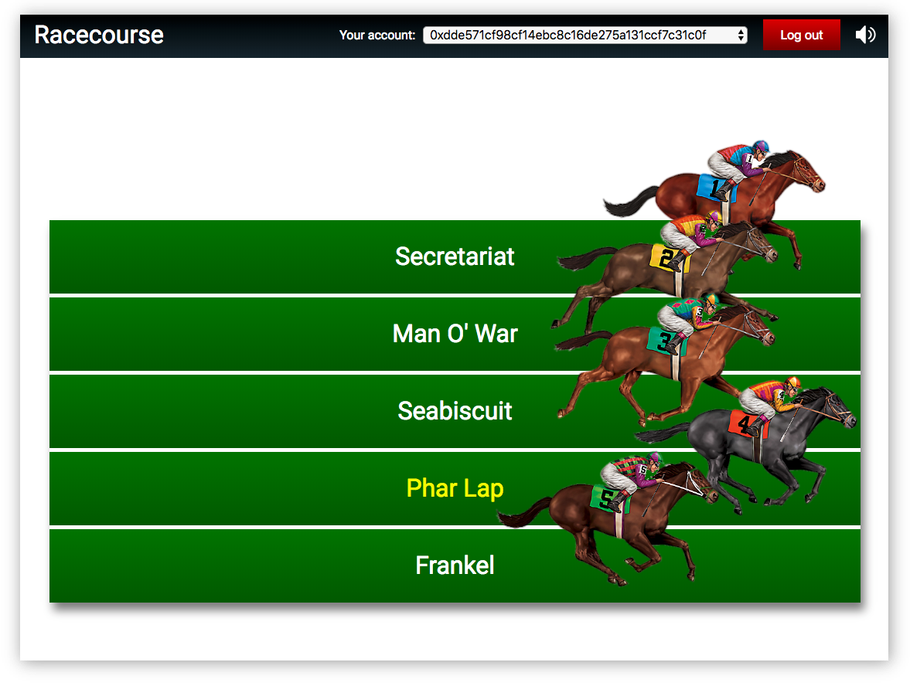
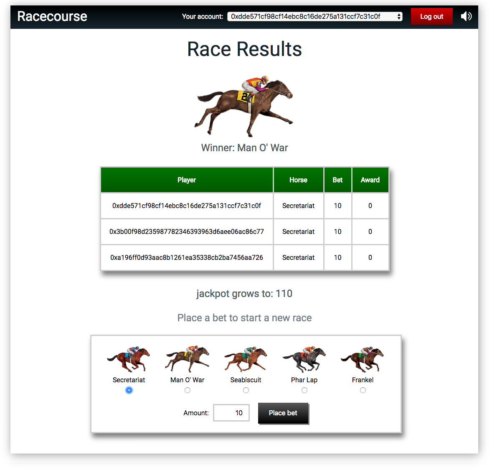

# Racecourse

<p align="center">
    
</p>

Horse racing game implemented as a decentralized application.

The front end is built using [React](https://reactjs.org) and [Redux](https://redux.js.org). The back-end is built on [NodeJS](https://nodejs.org/). Communication between the front-end and the back-end is carried out using [Socket.io](https://socket.io/). The game itself is implemented as a smart contract written in [Solidity](http://solidity.readthedocs.io).

<a href="https://glitch.com/edit/#!/remix/kaleido-io-racecourse-2">
    
</a>

### local environment setup

 1. Make sure you have NodeJS installed.

 2. In the repository folder run the following command:
    ```
    npm run start
    ```
 3. Open http://localhost:3000. Enter the provider credentials and click on "Connect".

### Game rules

 - Players must place bets by selecting a race horse and an amount.
 - No more than one bet per player is allowed in each race.
 - Once the bet is placed, players get to choose when they are ready to race.
 - Players may choose to race immediately or wait for others to join.
 - When all players are ready, the race takes place and the winning race horse is announced.
 - If one or more players had bet for the winning race horse, the jackpot will be distributed equally among them.
 - If there are no winners, the jackpot is carried over to the next race.

---

### Screen shots

<p align="center">
    
</p>

<p align="center">
    
</p>

<p align="center">
    
</p>

<p align="center">
    
</p>
